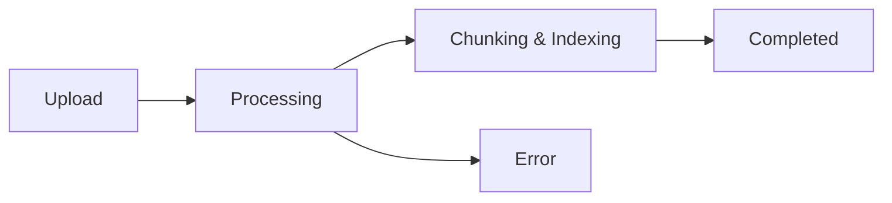

> ## Documentation Index
> Fetch the complete documentation index at: https://backboard-docs.docsalot.dev/llms.txt
> Use this file to discover all available pages before exploring further.


**Documents** are files you upload to provide context to your assistant. They can be attached at the assistant level (available to all threads) or thread level (specific conversation only).

## Key Properties

| Property | Description |
|----------|-------------|
| `document_id` | Unique identifier for the document |
| `filename` | Original filename |
| `status` | Processing status: `pending`, `processing`, `indexed`, `error` |
| `summary` | Auto-generated summary of the document |

## Supported Formats

- **PDF documents** (.pdf)
- **Text files** (.txt, .md)
- **Microsoft Office** (.docx, .xlsx, .pptx)
- **CSV and JSON files**
- **Source code files**

## Processing Pipeline



1. **Upload** - Document is received via API
2. **Processing** - Backboard extracts and parses the content
3. **Chunking & Indexing** - Content is split into chunks and embedded
4. **Completed** - Document is available for RAG queries

## Upload to Assistant (Shared)

Documents uploaded to an assistant are available across all threads:

```python
import requests

assistant_id = "your-assistant-id"

with open("knowledge-base.pdf", "rb") as f:
    response = requests.post(
        f"https://app.backboard.io/api/assistants/{assistant_id}/documents",
        headers={"X-API-Key": "your_api_key"},
        files={"file": f}
    )

document = response.json()
print(f"Document ID: {document['document_id']}")
print(f"Status: {document['status']}")
```

## Upload to Thread (Specific)

Documents uploaded to a thread are only available in that conversation:

```python
thread_id = "your-thread-id"

with open("conversation-context.pdf", "rb") as f:
    response = requests.post(
        f"https://app.backboard.io/api/threads/{thread_id}/documents",
        headers={"X-API-Key": "your_api_key"},
        files={"file": f}
    )
```

## Check Document Status

After uploading, poll the status until it's `indexed`:

```python
document_id = "your-document-id"

response = requests.get(
    f"https://app.backboard.io/api/documents/{document_id}/status",
    headers={"X-API-Key": "your_api_key"}
)

status = response.json()
print(f"Status: {status['status']}")
print(f"Chunks: {status.get('chunk_count')}")
```

<Warning>
Documents must reach `indexed` status before they can be used in conversations. Sending messages while documents are still processing may result in incomplete context.
</Warning>

## Related Endpoints

- [Upload to Assistant](/api-reference/assistants/upload-document)
- [Upload to Thread](/api-reference/threads/upload-document)
- [Get Document Status](/api-reference/documents/get-status)
- [Delete Document](/api-reference/documents/delete)
